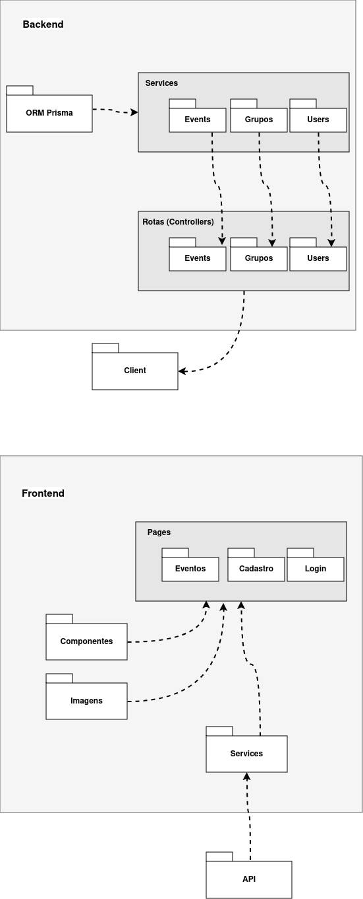
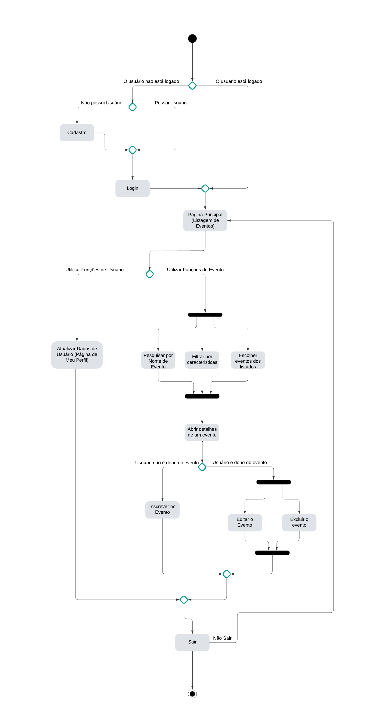

<h1 align='center'> Trabalho de Engenharia de Software </h2>

<h2 align='center'> Event Master </h2>

### Membros da equipe (Papel) [Mátricula]:

- Victor Yuji Yano (Full) [2022043337]

- Julio Assis Souza Amorim (Full) [2022043590]

- Marcos Daniel Souza Netto (Full) [2022069492]

- Gustavo Chaves Ferreira (Full) [2022043329]

### Sobre o projeto: 

<b>Objetivo geral</b>: Desenvolver um aplicativo para agendamento e gerenciamento dinâmico, público e privado, de eventos.

#### Backlog do produto:
1. Como usuário, eu quero poder criar, editar e deletar meus perfil.
2. Como usuário, eu quero personalizar meu perfil com foto e descrição para me apresentar aos demais.
3. Como usuário, eu quero poder criar, editar, deletar, listar e participar de eventos.
4. Como usuário, eu quero poder buscar eventos com filtros para encontrá-los.
5. Como usuário, eu quero visualizar eventos e buscar eventos específicos por meio de query.
6. Como usuário, eu quero poder visualizar grupos (categorias) dos eventos e filtrá-los por meio deles.
7. Como participante de evento, eu quero me inscrever no evento.
8. Como administrador, eu quero promover e demitir outros administradores, expulsar e readmitir usuários.
9. Como organizador de eventos, eu quero criar eventos públicos e permitir que usuários se inscrevam.
10. Como organizador de eventos, eu quero personalizar o evento com detalhes e fotos para enriquecer a experiência.
11. Redirecionar e compartilhar mensagens e eventos em eventos e conversas privadas.
12. Buscar mensagens em uma ou todas as conversas privadas e eventos.

<b>_Nota: Faremos as quatro primeiras no nosso primeiro sprint._</b>

#### Backlog do sprint:
1. Criar, editar, deletar e listar usuários.
2. Criar, editar, deletar, listar e participar de eventos.
3. Buscar eventos com queries e filtros (mecanismo de busca completo).
4. Promover e demitir administradores, expulsar e readmitir usuários.

### Tecnologias

- Linguagens: Typescript.

- Frameworks: 
    - <b>Backend</b>: Node.js + Express.
    - <b>Frontend</b>: React.js + Vite (Hot Reload) + MaterialUI (Componentização).

- Banco de Dados: PrismaORM + MySql (Em Docker).

## UML:

Diagrama de Pacotes:

Diagrama de Atividades:

